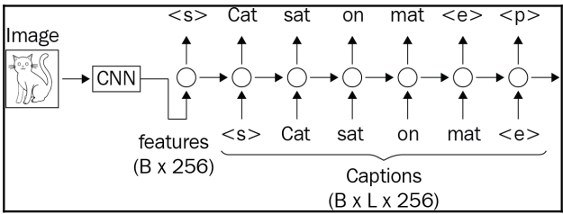
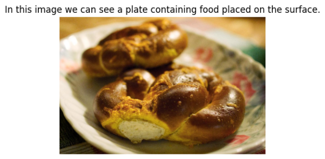

# Image-captioning
The goal is combine a CNN and LSTM to perform image captioning


<!--  -->
## Installation
```
git init
git clone https://github.com/Banana1206/Image-captioning.git
cd Image-captioning
pip install -r requirements.txt
```

## Model Architecture

## Data
Dowload json file
```
wget -O open_images_train_captions.jsonl -q https://storage.googleapis.com/localized-narratives/annotations/open_images_train_v6_captions.jsonl
```
Dowload images data
```
from openimages.download import _download_images_by_id
!mkdir -p train-images val-images
subset_imageIds = data[data['train']].image_id.tolist()
_download_images_by_id(subset_imageIds, 'train', './train-images/')

subset_imageIds = data[~data['train']].image_id.tolist()
_download_images_by_id(subset_imageIds, 'train', './val-images/')
```
finally this is sample data



## Output
